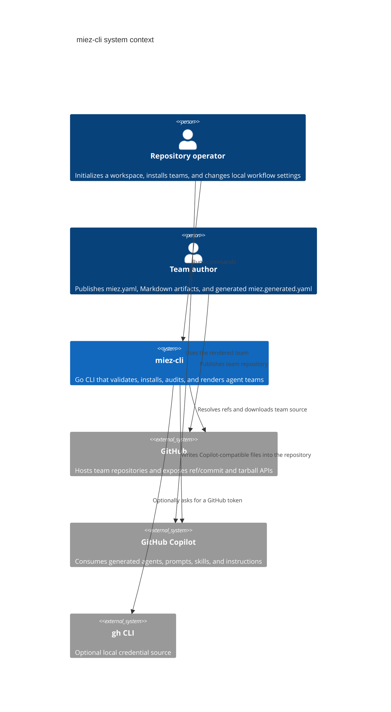
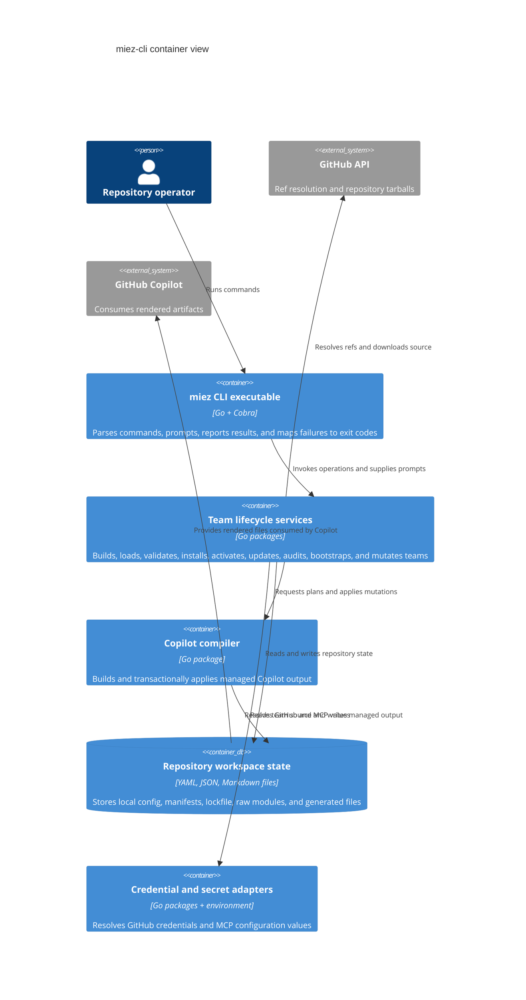
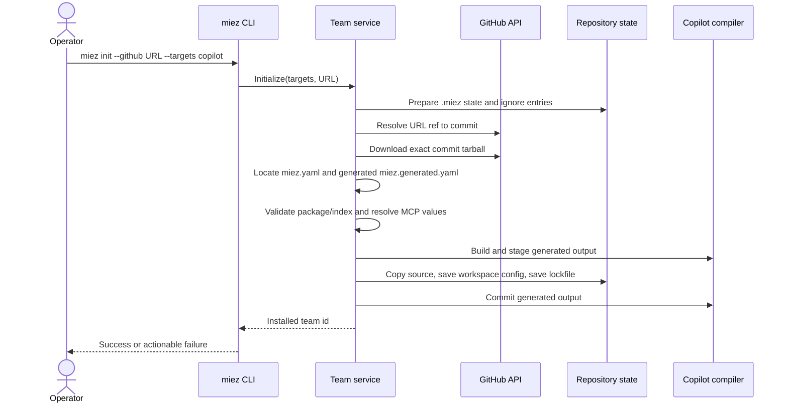
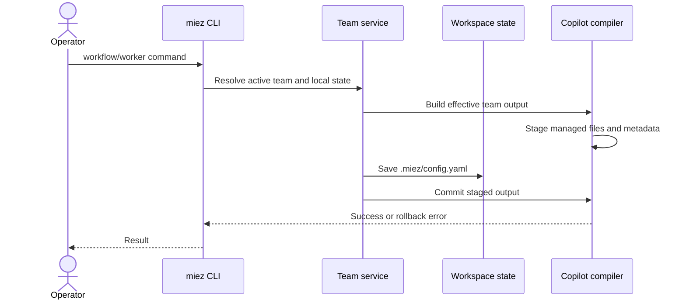
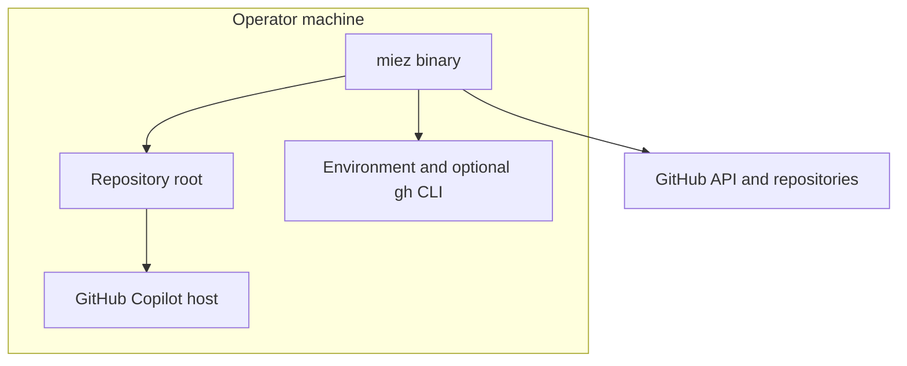

# Architecture description: miez-cli

This file is the as-is arc42 description of the Go CLI in this repository.
It reflects the implementation verified on 2026-09-15 and does not describe
unimplemented roadmap behavior.

## 1. Introduction and Goals

miez-cli is a local command-line tool for building, installing, and
configuring Markdown-based agent teams in a repository. A team package is
authored as `miez.yaml` plus Markdown workers, skills, tasks, and workflows;
`miez team build` generates the installable `miez.generated.yaml` catalog. miez fetches and
validates that catalog, stores a local source copy, renders the bundle to
GitHub Copilot locations, and records enough state for local overrides,
updates, and audits.

The system is intentionally adjacent to Copilot rather than an agent runtime:
Copilot consumes the generated prompts, custom agents, skills, and always-on
instructions. miez performs deterministic setup and state management; it does
not execute a worker, route a live request, call an LLM, or host a service.

### 1.1 Requirements overview

The living requirements are indexed in the
[miez-cli SRS index](srs/index.md), with one document per capability.
Change-specific proposal, contract, design, and task records may live under a
worker- or skill-owned `.miez/changes/` area while work is in progress; miez
does not create that area during initialization.

### 1.2 Quality goals

| Priority | Quality goal | Meaning in the current system |
|---|---|---|
| 1 | Reproducibility | A resolved GitHub commit and per-file hashes are retained in `.miez/miez.lock.yaml`. |
| 2 | Deterministic rendering | The same team and workspace state produce sorted, repeatable managed Copilot files. |
| 3 | Failure containment | Remote content and generated output are staged before activation, with rollback paths for most mutation failures. |
| 4 | Local control | Worker, skill, model, and workflow choices are stored as workspace state instead of editing the authored team. |
| 5 | Secret isolation | GitHub credentials and MCP values are kept out of committed team and distribution records. |
| 6 | Operator clarity | CLI commands report validation, update, audit, and authentication failures with actionable messages and conventional exit codes. |

## 2. Constraints

- The implementation is a Go 1.26.1 command-line executable.
- The only supported render target is GitHub Copilot.
- The only supported remote distribution host is GitHub over HTTP(S).
- The repository is file-backed; there is no database or miez server.
- Team packages are Markdown plus authored/generated YAML. The package manifest
  and generated team index are intentionally stricter than arbitrary YAML and
  reject unknown fields.
- The current workspace model has one active team, although the lockfile can
  retain entries for multiple installed teams.
- The external GitHub API and optional `gh` CLI are runtime dependencies for
  remote operations. Local validation and audit do not require a network.
- The CLI must work in both interactive terminals and non-interactive/CI
  contexts. Missing MCP values fail clearly outside a usable terminal.
- `.miez/miez_modules/` and `.miez/mcp.local.yaml` are ignored local data.
  `.miez/miez.lock.yaml` is a committed repository file. Other `.miez/`
  directories are created only by workers or skills that declare them.

## 3. Context and Scope

### 3.1 Business context

The operator wants a repeatable way to bring a team of specialized Markdown
workers into a repository and expose that team to GitHub Copilot. Team authors
publish the portable source independently. The operator can select a team,
change local participation and model settings, and keep the installation
under source-control review through a manifest and lockfile.

### 3.2 Technical context

### 3.3 Scope boundary

Inside the system boundary are CLI argument handling, team artifact loading and
validation, source staging, GitHub access, credential selection, MCP value
resolution, workspace state, lockfile and audit logic, and Copilot rendering.

Outside the boundary are GitHub's repository and API behavior, the operator's
credential stores and environment, the `gh` executable, and Copilot's actual
agent execution. The local repository is both the installation target and the
persistence boundary.

## 4. Solution Strategy

1. **Build a deterministic team index.** Package metadata and Markdown
  frontmatter are compiled into `miez.generated.yaml` before publication or install.
2. **Keep authored source separate from generated output.** Remote teams are
  copied into `.miez/miez_modules/<team-id>/`; generated files are managed below
   `.github/`; bootstrap output is an authoring directory outside both.
3. **Use a file-backed domain model.** YAML manifests and Markdown frontmatter
   define teams, while `.miez/config.yaml` records workspace-local choices.
4. **Render one provider-specific target.** The compiler has a Copilot target
  and maps worker agents, task prompts, skills, rules, and workflow phases to
  fixed Copilot file kinds.
5. **Resolve remote state before installation.** GitHub refs are resolved to a
   commit before the tarball is selected, and updates avoid downloading when
   the commit is unchanged.
6. **Validate before activation.** The downloaded team is loaded and checked,
   MCP values are resolved, and a render plan is built before the previous
   active source is replaced.
7. **Track source integrity separately from output management.** The lockfile
  hashes installed source files; the compiler derives its previous generated
  paths from the active team and workspace state instead of persisting a
  compiler manifest or summary.
8. **Keep the CLI thin around a domain service.** Cobra commands own parsing,
   prompting, output, and exit-code translation. `internal/team.Service`
   coordinates deterministic domain operations.
9. **Prefer bounded, path-safe file operations.** Archive extraction, artifact
   reads, copying, and managed output reject traversal, symlinks, unsupported
   file kinds, unmanaged overwrites, and configured archive limits.

The choices with explicit alternatives are indexed in section 9.

## 5. Building Block View

### 5.1 Container view

### 5.2 Container responsibilities

| Container | Responsibility | Does not own |
|---|---|---|
| miez CLI executable | Command tree, flags, prompts, output, shell completion, signal-aware execution, exit codes | Team lifecycle policy or file-format implementation |
| Team lifecycle services | Domain orchestration for build, install, update, audit, bootstrap, and local state transitions | Interactive presentation and Copilot execution |
| Copilot compiler | Validation-backed render plans, managed-file manifest, staged output, rollback/commit | Remote download and lockfile policy |
| Repository workspace state | Durable and ignored files used by the CLI and Copilot | A remote source of truth or database transactions |
| Credential and secret adapters | Environment/CLI credential lookup and MCP placeholder handling | Long-term credential management or secret encryption |

Package-level structure and file contracts are documented in the SDDs:
[artifact and rendering design](sdd/sdd-artifact-and-rendering.md) and
[workspace and distribution design](sdd/sdd-workspace-and-distribution.md).

## 6. Runtime View

### 6.1 Initialization and team installation

The previous active source is moved aside only after the new render plan is
ready. Source, compile, and workspace preparation have rollback paths. The
lockfile write is performed after workspace config persistence; a lockfile
write failure is a known consistency risk recorded in section 11.

### 6.2 Local workflow or worker mutation

Workflow selection replaces the generated workflow-routing instruction; exactly
one workflow is always active. Rules, when present, are rendered independently.
Worker skills, models, and disabled workers are workspace overrides and do not
rewrite the team source.

### 6.3 Update, outdated, and audit

- `team update` loads the installed lockfile entry, resolves the same ref, and
  stops before a tarball download when the commit is unchanged. When changed,
  it stages one tarball, presents file differences, and reuses that staged
  source if the operator approves.
- `team outdated` performs only ref-to-commit checks for selected lockfile
  entries. It reports current versus latest commits and never writes state.
- `team audit` reads local source and lockfile hashes only. It reports modified,
  missing, and extra files and can translate a dirty result to exit code 1 in
  CI mode.

### 6.4 Missing MCP configuration

The active and enabled workers determine which declared MCP servers matter.
Placeholder variables are resolved from the local MCP store and process
environment. A missing value is prompted for only when the CLI has a usable
interactive terminal and CI is not set; otherwise the operation fails before
source replacement or compilation is committed.

## 7. Deployment View

### 7.1 Development and operator deployment

miez is a locally executed binary. It runs with the operator's filesystem
permissions at the repository root supplied to the CLI. The repository is the
installation target and contains both committed and local workspace state.

### 7.2 Repository placement

| Location | Lifecycle | Purpose |
|---|---|---|
| `miez.yaml` | committed, user-managed | Team package metadata or workspace team-source map |
| `.miez/miez.lock.yaml` | committed, miez-managed | Installed team ref, commit, version, source file list, and hashes |
| `.miez/config.yaml` | local workspace state | Targets, active team, workflow, worker, skill, and model overrides |
| `.miez/mcp.local.yaml` | ignored local secret values | Resolved MCP environment values |
| `.miez/changes/`, `.miez/runs/` | optional artifact-owned areas | Work records or runtime handoffs when declared by workers or skills |
| `.miez/miez_modules/<team-id>/` | ignored raw source | Installed remote team source |
| `.github/agents/`, `.github/prompts/`, `.github/skills/`, `.github/instructions/` | generated Copilot output | Files consumed by Copilot and managed from team/state path derivation |

## 8. Cross-cutting Concepts

### 8.1 State ownership

Authored package files define the portable contract. `miez.generated.yaml` is the
generated operational catalog. `.miez/config.yaml` defines workspace-local
choices. A workspace `miez.yaml` defines human-readable remote aliases.
`.miez/miez.lock.yaml` defines the installed source snapshot. The compiler
derives which generated files miez is allowed to replace or remove from the
previous and next effective team views, with one-time support for the legacy
`.miez/manifest.json` during migration.

### 8.2 Validation and identity

A package build and generated-index decode use known fields. Identifiers are
validated as kebab-case, with a more permissive lower-case dotted model-id
grammar. Worker, skill, workflow, phase, model, and MCP references are checked
before rendering.
A team installed below `.miez/miez_modules/` must have an id matching its
directory.

### 8.3 Compilation and managed files

The compiler first builds a complete in-memory plan. It then stages generated
files, derives the previous managed paths from the active team and state,
backs up those paths, and refuses to overwrite an unmanaged generated path.
Legacy compiler metadata is removed after a successful migration. Rules and
workflow routing are separate generated instructions, and effective skills
are linked from workers rather than inlined.

### 8.4 Remote access and credentials

GitHub access uses a fixed credential priority: per-organization miez PAT,
miez PAT, `GITHUB_TOKEN`, `GH_TOKEN`, then `gh auth token`. The resolved token
is passed to GitHub requests and is never written to repository artifacts. No
git credential-helper fallback is attempted.

### 8.5 Secret handling

MCP placeholders are parsed from the team manifest. Requirements are gathered
only for enabled workers and are resolved in deterministic order. Values are
stored with restrictive local file permissions in `.miez/mcp.local.yaml`.

### 8.6 Errors, cancellation, and exit codes

The CLI translates argument/flag errors to code 2, prompt cancellation to code
130, and dirty audit CI results to code 1. Other failures are returned to the
main process and exit with code 1. Context cancellation is passed to remote
requests and copy operations. Interactive prompt reads run separately so a
canceled context can stop waiting for input.

### 8.7 Filesystem and archive safety

Remote archives have compressed, expanded, per-file, and file-count limits.
Archive paths must remain local, and unsupported tar entries are rejected.
Team copying rejects symlinks and special files. Managed output validates each
path and every existing parent for symlink traversal before replacement.

## 9. Architecture Decisions

The following ADRs capture choices where the repository history and source
showed an explicit alternative:

- [ADR 0001: GitHub Copilot is the sole render target](adr/0001-copilot-only-render-target.md)
- [ADR 0002: Keep modules and the lockfile at repository root](adr/0002-root-modules-and-lockfile.md)
- [ADR 0003: Use a fixed GitHub credential chain without git credential helper fallback](adr/0003-github-credential-chain.md)
- [ADR 0004: Render rules separately from workflow routing](adr/0004-separate-rules-and-workflow-instruction.md)
- [ADR 0005: Fail early for unresolved MCP configuration](adr/0005-fail-early-mcp-configuration.md)
- [ADR 0007: Generate the team index from package metadata and frontmatter](adr/0007-generated-team-index.md)
- [ADR 0008: Keep miez distribution state inside `.miez`](adr/0008-miez-owned-distribution-state.md)
- [ADR 0006: Store workflow coordination as Markdown artifacts](adr/0006-markdown-workflow-artifacts.md)

The staged installation and managed-output transaction are implementation
patterns documented in the SDDs; no separate ADR is asserted for them because
the current repository does not preserve a distinct alternatives record.

## 10. Quality Requirements

The quality requirements and pass/fail checks are in the SRS. The most
architecture-sensitive scenarios are:

- A repeated local render is deterministic for unchanged source and state.
- `team outdated` writes nothing, and `team audit` uses no network.
- A missing MCP value in CI fails instead of hanging or passing a placeholder.
- A remote archive or generated path cannot escape its intended root.
- An update can be reviewed before it is applied.
- A failure during source staging or compilation does not activate the new
  team or leave generated output half-installed.

The system has no formal latency or throughput target. GitHub API calls use a
30-second client timeout and archive limits bound download work.

## 11. Risks and Technical Debt

- **Lockfile/config write ordering:** team installation saves workspace config
  before saving `.miez/miez.lock.yaml`. If the lockfile write fails after config has
  succeeded, source and generated output rollback can leave `.miez/config.yaml`
  pointing at the new team while the previous source remains installed.
- **No process-level workspace lock:** concurrent miez processes can race on
  `.miez/config.yaml`, generated files, modules, or the lockfile.
- **Remote API resilience:** rate-limit responses are reported, but the client
  has no retry or backoff policy.
- **Interactive prompt coverage:** the test suite is broad but does not fully
  exercise real terminal masking, prompt cancellation races, or every failure
  during old-source restoration.
- **Artifact-owned work lifecycle:** work records and runtime handoffs created
  by workers or skills have no generic miez retention or archival policy.
- **Release governance:** no release automation or formal compatibility matrix
  is present in the repository.

## 12. Glossary

| Term | Meaning |
|---|---|
| Team | A portable package described by `miez.yaml`, generated `miez.generated.yaml`, and Markdown artifacts. |
| Worker | A command or agent Markdown artifact that Copilot can invoke or host. |
| Skill | Reusable Markdown capability linked from a worker's rendered artifact. |
| Workflow | Ordered phases that list participating worker ids and can become a routing instruction. |
| Rule | Freeform team Markdown rendered into an always-on Copilot instruction independently of workflow routing. |
| Active team | The one team selected in `.miez/config.yaml` whose output is currently rendered. |
| Module | The raw installed team source under `.miez/miez_modules/<team-id>`. |
| Manifest | A team package or workspace `miez.yaml`. |
| Lockfile | `.miez/miez.lock.yaml`, recording installed source identity and hashes. |
| Target | A rendering provider; only `copilot` is currently supported. |
| MCP | A declared tool server and its environment requirements for workers. |
| Staged team | A validated temporary download not yet installed as the active source. |
| Managed output | A file whose path is derived from the previous or next effective team view and is therefore eligible for compiler replacement/removal. |
