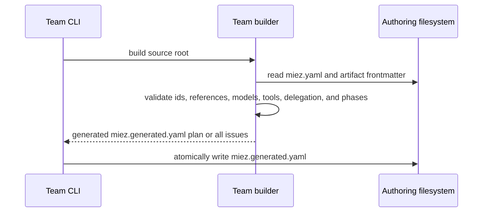
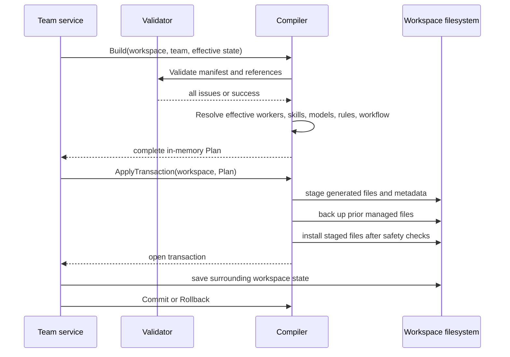

# SDD: team artifacts and Copilot rendering

IEEE 1016 software design description for the planned package build,
artifact-loading, validation, local override, and Copilot-rendering structure.

## 1. Context

SRS IDs this design satisfies:

- `artifact/team-contract-is-loadable`
- `artifact/team-index-is-generated`
- `artifact/model-catalog-uses-stable-ids`
- `artifact/markdown-contract-is-enforced`
- `artifact/frontmatter-declares-cli-configuration`
- `artifact/workflow-artifacts-are-discoverable`
- `team-authoring/build-produces-installable-package`
- `check/validates-team-artifacts`
- `render-contract/github-copilot-is-the-only-render-target`
- `render-contract/authored-folders-map-to-agents-and-prompts`
- `render-contract/skills-are-referenced-not-inlined`
- `render-contract/rules-are-a-separate-always-on-instruction-from-workflow-routing`
- `render-contract/selected-workflow-is-always-on`
- `model/stable-identifiers-map-to-copilot-names`
- `workflow/selection-and-routing`
- `workflow/selection-replaces-the-active-instruction`
- `workflow/completion-uses-the-installed-catalog`
- `workflow/worker-toggles-preserve-a-usable-workflow`
- `worker/skill-overrides-are-local`
- `worker/agent-model-overrides-are-local`
- `reliability/mutations-are-transactional`
- `determinism/local-rendering-is-repeatable`
- `security/remote-input-is-bounded-and-path-safe`
- `team-authoring/bootstrap-includes-guided-authoring-support`
- `team-authoring/support-files-are-not-operational-artifacts`
- `team-authoring/installed-source-retains-support-files`

Place on the system map: this is the Copilot compiler container and the
artifact-related part of the team lifecycle service.

Decisions this design follows:

- [ADR 0001: GitHub Copilot is the sole render target](../adr/0001-copilot-only-render-target.md)
- [ADR 0004: Render rules separately from workflow routing](../adr/0004-separate-rules-and-workflow-instruction.md)
- [ADR 0007: Generate the team index from package metadata and frontmatter](../adr/0007-generated-team-index.md)
- [ADR 0008: Keep miez distribution state inside `.miez`](../adr/0008-miez-owned-distribution-state.md)

The design consumes authored team source and workspace-local state. It does
not execute Copilot prompts or workflows.

## 2. Composition

| Part | Owns |
|---|---|
| `internal/model` | YAML-facing `Team`, `Worker`, `Skill`, `Task`, `Workflow`, `TeamState`, MCP, and model catalog types; effective worker skills/models and active workflow identity |
| `internal/artifacts` | Generated team index decoding, worker/skill/task/workflow Markdown loading by declared paths, safe relative paths, symlink checks, directory copying, and file walking |
| `internal/build` | Package metadata and Markdown frontmatter loading, cross-reference validation, deterministic `miez.generated.yaml` generation, and atomic output replacement for all four artifact roles |
| `internal/validate` | Collection of actionable contract issues across package metadata, generated index identity, references, models, MCP ids, workflow phases, and artifact files |
| `internal/compile` | Complete render plan, Copilot path mapping, worker/skill/task/workflow rendering, generated-file collision checks, and staged output transaction |
| `internal/workspace` | `.miez/config.yaml`, repository-local paths, and workspace state used by the compiler |
| `internal/team` | Coordinates validation, compiler calls, workspace state updates, and lifecycle operations; owns no rendered format details |
| bootstrap support bundle | README and Copilot authoring helpers shipped with a new team source; it is not an operational catalog entry |

The compiler depends on `artifacts`, `model`, `validate`, and `workspace`. The
CLI and team service call it; Copilot is not a callable dependency.

## 3. Information

### 3.1 Authored package manifest

The team authoring root contains `miez.yaml`, a package-style source manifest.
It identifies the package as a team and owns metadata that cannot be inferred
from an individual artifact: team id, name, version, description, author,
default model, model catalog, and MCP declarations. It is authored and remains
in the published package.

A consuming repository may also have a root `miez.yaml`; that workspace form
owns repository metadata and named team sources. A team package is recognized
by its required package metadata and artifact directories; a workspace manifest
is recognized by its `teams` map. No type discriminator is required.
Active team and workflow selections are not stored in either package manifest;
they remain in `.miez/config.yaml`.

### 3.2 Generated team index

`miez.generated.yaml` is generated by the build operation and decodes into `model.Team`:

- copied package identity and descriptive metadata;
- model catalog and MCP declarations from the package manifest;
- `skills[]` entries with id and source path;
- `workers[]` entries with id, kind, derived source path, optional model,
  skill ids, and MCP tool ids;
- `tasks[]` entries with id, derived source path, and description;
- `workflows[]` entries with id, display name, source path, and ordered phases
  containing worker ids or explicit worker/task assignments.

The generated index is the only installed team catalog used for workflow,
worker, skill, task, model, and MCP completion or validation. It is decoded with YAML
known-field checking. Installation does not parse authoring frontmatter to
reconstruct missing relationships.

### 3.3 Frontmatter and build inputs

Worker frontmatter declares `kind: agent` and optional `skills`, `model`, and
MCP `tools`; every worker renders as a Copilot agent. Task frontmatter declares
an optional `description`; it does not bind the task to a worker. Skill identity
is derived from its directory.
Workflow frontmatter declares its display `name` and ordered `phases`; each
phase may use worker ids or explicit worker/task assignments. Artifact paths
are derived from their locations and written into the generated index. Markdown
bodies remain the authored prompt, persona, task objective, or coordination
content.

The build operation parses every frontmatter block, validates identifiers,
duplicates, references, model mappings, and safe paths, then emits a sorted,
deterministic `miez.generated.yaml` atomically. A failed build leaves an existing index
unchanged.

### 3.4 Markdown artifacts

Workers and tasks may use any safe relative Markdown path declared in
`miez.generated.yaml`. Skills use the generated path declared in the skill
catalog, normally `skills/<skill-id>/SKILL.md`. Build-time parsing validates
frontmatter and retains each Markdown body. At installation time, operational
metadata comes only from `miez.generated.yaml`; the body loader may strip the
frontmatter block for rendering but does not use it to reconstruct ids, skills,
models, tools, or workflow assignments. The loader rejects symlinks
and paths outside the team root.

### 3.5 Effective workspace state

`TeamState` is derived from `.miez/config.yaml` and overlays the authored team:

- `active_workflow` selects exactly one workflow declared by the generated
  index;
- `disabled_workers` filters workers from generated workflow phases;
- `worker_skills` adds skills and `removed_skills` masks authored skills;
- `worker_models` overrides a worker's stable model id.

The workflow is always active while a team is active. The overlay is
non-destructive: no command in this design rewrites the team manifest or
authored Markdown.

### 3.6 Rendered output

For the current Copilot target, the compiler maps effective artifacts to:

| Input | Managed output |
|---|---|
| worker agent | `.github/agents/<id>.md` with Copilot model frontmatter |
| worker-neutral task | `.github/prompts/task-<id>.prompt.md` |
| effective skill | `.github/skills/<skill-id>/SKILL.md` and a relative Markdown link in each using worker |
| `rules/*.md` | `.github/instructions/miez-rules.instructions.md` |
| selected workflow entry and Markdown body | `.github/instructions/miez-workflow.instructions.md` |

The compiler prepends Copilot's always-on `applyTo: "**"` frontmatter to the
selected workflow body and renders its effective ordered phases after applying
workspace worker overrides. A worker-neutral task prompt relies on the
currently selected agent context. The task contract uses provider-
supported agent delegation or handoffs for multi-worker workflows and never
depends on nested slash-prompt invocation. The managed output transaction
derives the old and new generated path sets from the previous and next team
catalogs plus workspace state; it does not persist a compiler manifest or
compilation summary below `.miez/`.

### 3.7 Bootstrap support bundle

A bootstrapped team source includes a README and a fixed set of Copilot-native
authoring helpers. The helpers explain and enforce the team authoring boundary:
worker persona versus reusable skill, workflow registration, the target
agent-only worker contract, frontmatter, and the distinction between authored
metadata and the generated team index. The always-on authoring instruction is
separate from workflow routing, just as operational team rules are separate
from workflow routing.

These support files are package content, not `model.Team` entities. The builder
does not derive worker, skill, task, or workflow entries from them, and the generated
team index does not need a new support-file schema. The installer copies them as
part of the validated source module, so the README and helpers remain available
to a team author and are included in the lockfile's regular-file inventory.

The installer retains the authoring helpers in the source module, but the
compiler does not copy them into the consuming workspace's active `.github`
tree. They are available while the team package is being authored and remain
documented source content after installation; rendering them as active output
is a separate future capability.

## 4. Interface

### Provided interfaces

- `artifacts.LoadTeam(root)` loads one team manifest.
- `artifacts.TeamDir.ReadWorker(worker)`, `ReadSkill(skill)`, `ReadTask(task)`,
  and `ReadWorkflow(workflow)` load Markdown artifacts using paths from the
  generated index.
- `build.Build(sourceRoot)` validates package metadata and artifact
  frontmatter, then returns a deterministic generated `miez.generated.yaml` plan.
- `build.Apply(sourceRoot, plan)` atomically writes the generated team index.
- `validate.Team(teamDir)` returns all discovered `validate.Issue` values.
- `compile.Build(workspace, teamDir, state)` returns an in-memory `Plan` or a
  validation/rendering error.
- `compile.ApplyTransaction(workspace, plan)` stages the plan and returns a
  transaction whose `Commit` or `Rollback` completes the surrounding mutation.
- `model` effective-state helpers resolve the active workflow, effective
  workers, effective skills, and effective model ids.

The bootstrap operation supplies the support bundle as source files. The build
operation validates and catalogs only operational artifacts while leaving the
support bundle opaque. Installation and audit include all regular package files
in the installed source module and its integrity inventory.

The render plan carries the deterministic set of paths managed by the current
and previous effective team views. A legacy `.miez/manifest.json` may be read
once during migration to identify old managed paths, but successful rendering
removes that compatibility record and never writes a replacement.

### Required inputs and errors

The compiler requires an initialized workspace with a target list, a loaded
team directory, and a team state whose active workflow exists in the catalog.
It returns errors for invalid manifests, unsupported targets, missing or
malformed artifacts, missing active workflows, unresolved models, path
collisions, symlink traversal, unmanaged overwrites, and filesystem failures.
The build operation additionally returns errors for invalid package metadata,
frontmatter, duplicate ids, unresolved phase workers, and invalid generated
index relationships.

The compiler does not prompt. Interactive decisions and MCP prompting happen
in the CLI/team service before compilation.

Task-specific catalog and invocation structure is detailed in the [task
artifacts and invocation SDD](sdd-task-artifacts-and-invocation.md). The
artifact compiler remains the owner of validation, deterministic output, and
transactional replacement; task execution remains outside miez.

## 5. Interaction

### 5.1 Team build

The builder never scans frontmatter during installation. It derives paths from
the `workflows/`, `workers/`, `skills/`, and task artifact locations, sorts all
catalogs and fields deterministically, and refuses to replace an existing
generated index when validation fails.

### 5.2 Build and apply

`Build` has no filesystem mutation beyond reading source. Before staging,
`ApplyTransaction` receives the previous and next effective team views and
derives the union of their known managed paths: worker outputs, effective
skill files, rules, and workflow instructions. It backs up only those paths,
refuses to overwrite an existing unmanaged path, and keeps the backup until
the caller persists the related workspace state. Rollback removes newly
installed files and restores backups in reverse order. A legacy manifest is
used only as a migration aid and is removed after the surrounding transaction
commits.

### 5.3 Worker and skill resolution

For each team worker, the compiler reads the worker body, calculates the
effective skill list, and emits each skill file. It then appends one generic
`## Skills` section to the worker only when the list is non-empty:

> Additionally to your persona, read every linked skill, follow its
> instructions, and keep skill-specific know-how in context.

Each effective skill is listed as a relative Markdown link from the worker
output, for example `[architecture](../skills/architecture/SKILL.md)`. The
skill body is emitted only in its canonical `.github/skills/<skill-id>/SKILL.md`
file and is never copied into the worker. The target worker contract renders
every worker as a Copilot agent, resolving its effective stable model id through
the merged built-in/team catalog and prepending its Copilot name as frontmatter.

The merged model catalog is keyed by stable id. Team entries replace built-in
entries with the same id while preserving catalog order for listing. The CLI
derives both model listing and model-argument completion from those ids; it
does not require a display-name field. Copilot rendering resolves the selected
id to its provider mapping separately.

### 5.4 Task rendering and agent delegation

The compiler reads each task body as a reusable work objective. A base task
prompt tells the currently selected worker to apply its persona and effective
skills, then supplies the task body and leaves user-specific context to the
current Copilot request. It does not copy the worker body or skill bodies into
the base task prompt.

The task prompt is worker-neutral and runs in the currently selected worker
agent context. If a provider-specific entry point needs to select an agent
automatically, the compiler may use the prompt file's supported `agent`
metadata; it does not nest one prompt invocation inside another. Multi-worker
workflow automation uses provider-supported agent delegation or handoffs, with
the workflow identifying valid worker agents and the available delegation
relationship.

Task-aware workflow phases carry explicit worker/task assignments. The workflow
instruction can describe how those assignments are ordered, handed off, or
reviewed, while miez only validates and renders the references. It does not
execute the assignments or report a phase complete.

### 5.5 Workflow selection and rendering

Workflow completion reads the active team's catalog from its installed source
and returns sorted ids without contacting GitHub. `workflow use` validates the
selected id from `miez.generated.yaml`, sets `active_workflow`, and rebuilds the managed
output. The selected workflow body is copied into the workflow instruction with
always-on Copilot frontmatter, and its generated phase metadata is filtered by
the local disabled-worker set before rendering. miez never changes the
authored body or worker frontmatter.

Rules are read from the team's `rules/` directory, limited to Markdown files,
sorted by filename, and concatenated into a separate always-on instruction.
Changing the selected workflow replaces only the workflow instruction; rules
remain independently managed. The compiler does not add a fixed `.miez/runs/`
or `.miez/changes/` location to generated workflow instructions; any work area
is part of the authored worker or workflow contract.

### 5.5 Bootstrap and package support

The bootstrap flow writes the normal team manifest and starter operational
artifacts, then writes the README and the fixed Copilot authoring support
bundle. It refuses to overwrite an existing team as it does for the existing
starter files and does not create `miez.generated.yaml`.

The build flow reads the manifest and operational artifact frontmatter, validates
their relationships, and generates the same catalog regardless of the presence
of support files. The install flow copies the validated package source in full;
the lockfile records the support files alongside the operational artifacts.

## 6. Resource

The compiler runs in the local miez process and builds the complete plan in
memory before staging it under a temporary `.miez-compile-*` directory in the
repository. It is intentionally synchronous and deterministic; there is no
shared compiler service or concurrent render worker.

Resource limits are inherited from the filesystem and available memory for the
plan. Workflow discovery is a bounded local directory scan and is sorted for
repeatable completion and rendering. Remote archive limits are enforced by
`ghclient` before the compiler sees the source. Temporary staging is removed on
commit or rollback. A failed render does not intentionally leave generated
output changed, although the surrounding install operation must also complete
its own state and lockfile writes for the overall mutation to be consistent.
