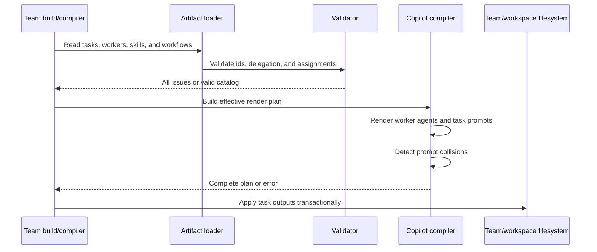
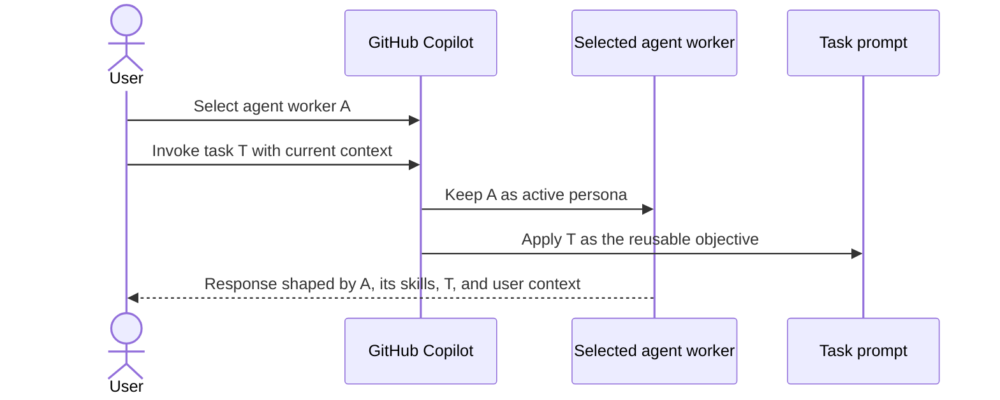
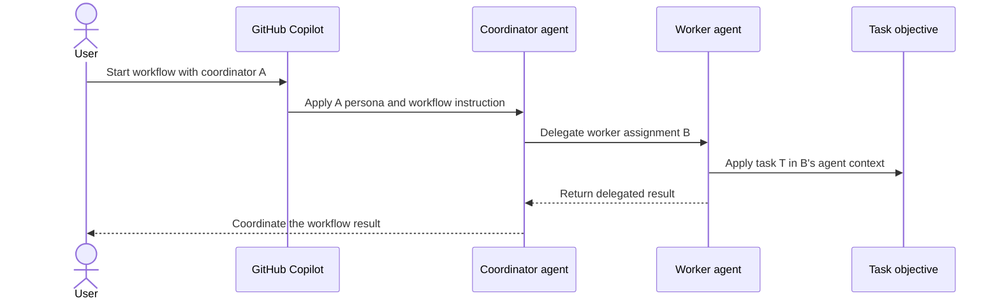

# SDD: task artifacts and worker invocation

IEEE 1016 software design description for the task artifact,
Copilot prompt rendering, and agent-only worker/task composition model.

**Status:** implemented design, drafted 2026-09-16.

## 1. Context

SRS IDs this design satisfies:

- `task/domain-roles-are-distinct`
- `worker/all-workers-render-as-agents`
- `task/is-a-reusable-work-objective`
- `task/is-discoverable`
- `task/catalog-includes-task-relationships`
- `task/renders-as-a-copilot-prompt`
- `task/selected-agent-context-is-preserved`
- `task/user-request-is-task-context`
- `workflow/agent-delegation-is-explicit`
- `task/prompt-composition-is-not-nested`
- `task/workflow-task-assignments-are-valid`
- `task/prompt-identifiers-are-unique`
- `task/rendering-is-deterministic`
- `task/rendering-is-traceable`
- `task/copilot-is-the-only-render-target`
- `task/miez-does-not-execute-tasks`
- `task/agent-invocation-is-select-then-prompt`
- `task/agent-invocation-is-the-composition-boundary`

Place on the existing system map: this is an extension of the team artifact
builder and Copilot compiler containers. It adds no process, database, or
deployment container.

Decisions this design follows:

- [ADR 0001: GitHub Copilot is the sole render target](../adr/0001-copilot-only-render-target.md)
- [ADR 0004: Render rules separately from workflow routing](../adr/0004-separate-rules-and-workflow-instruction.md)
- [ADR 0007: Generate the team index from package metadata and frontmatter](../adr/0007-generated-team-index.md)

The design does not make a new decision record. The important boundaries are
explicit in the design: every worker is a Copilot custom agent, tasks are
worker-neutral prompts, and workflows use provider-supported agent delegation
or handoffs rather than nested prompt invocation.

## 2. Composition

| Part | Owns |
|---|---|
| Task artifact loader | Reads task Markdown and task frontmatter, derives the task id from its source path, and validates task references. |
| Generated team catalog | Carries task ids, source paths, descriptions, and workflow assignment/delegation metadata. |
| Agent renderer | Renders every worker as a Copilot custom agent with its persona, effective skills, tools, model, and optional subagent/handoff configuration. |
| Task prompt renderer | Produces a worker-neutral Copilot prompt that supplies the task objective and runs in the selected agent context. |
| Workflow renderer | Preserves ordered worker/task assignments and supported agent delegation or handoffs in the always-on workflow instruction without executing them. |
| Managed-output planner | Tracks task prompts and agents as owned generated paths, detects identifier collisions, and removes obsolete outputs transactionally. |

The task renderer depends on the existing artifact loader, worker effective
skill resolution, validation, and Copilot compiler. It does not call Copilot,
an LLM, or a worker runtime.

## 3. Information

### 3.1 Task source artifact

Tasks are authored as Markdown files below a task artifact directory. The file
name is the stable task id. The minimal frontmatter is:

```yaml
---
description: Analyze an existing solution and document its requirements.
---
```

The task body is a reusable prompt objective. It may describe the work,
expected output, constraints, and completion checks. It must not become a
second worker persona or copy a skill body.

Tasks do not declare a worker. A task with no worker binding remains reusable
with any selected worker agent. If a provider-specific task entry needs to
select an agent automatically, the compiler may set the provider's supported
`agent` prompt metadata for that derived entry; that binding belongs to the
rendered entry, not to the canonical task source.

### 3.2 Generated catalog

The target generated team catalog adds a `tasks` collection:

```yaml
tasks:
  - id: analyze-existing-solution
    path: tasks/analyze-existing-solution.md
    description: Analyze an existing solution and document its requirements.
```

The catalog does not store rendered output paths as authored truth. Output
paths are derived deterministically from the task id, worker id, and target.

### 3.3 Workflow assignments

Task-aware workflow phases use explicit worker/task assignments:

```yaml
phases:
  - id: analyze
    coordinator: software-architect
    delegates: [reviewer]
    assignments:
      - worker: software-architect
        task: analyze-existing-solution
```

Multiple assignments may occur in one phase. Each assignment is independently
validated and keeps its declared order. Existing worker-only phases remain a
compatibility form during migration; a task-aware phase uses assignments
instead of relying on positional pairing between separate worker and task
lists. `coordinator` and `delegates` express provider-supported agent
delegation when the workflow requires automatic multi-worker behavior. The
workflow Markdown body remains the narrative source for ordering, handoffs,
parallelism, and completion semantics.

### 3.4 Agent delegation and rendered identities

Custom agents are the only worker output. Provider-supported agent delegation
or handoff metadata is the composition point for multi-worker workflows. A
workflow may identify a coordinator agent and the worker agents it may delegate
to; the active agent must have the provider's agent/subagent tool available for
automatic delegation. A workflow body alone cannot invoke a prompt file.

The compiler reserves distinct prompt namespaces:

| Source | Copilot output | User invocation shape |
|---|---|---|
| Worker agent | `.github/agents/<worker-id>.agent.md` | Select the agent in Copilot |
| Worker-neutral task | `.github/prompts/task-<task-id>.prompt.md` | `/task-<task-id>` after selecting an agent |

The `task-` prefix separates task prompts from agent names. The compiler
rejects any remaining collision among generated agent and task identifiers.

## 4. Interface

### 4.1 Authoring interface

Team authors provide task Markdown and reference workers and tasks from
workflow assignment metadata. They do not duplicate a worker persona in every
task and do not assign skills directly to tasks; skills remain worker
capabilities. Every worker source is intended to render as a custom agent.

### 4.2 Copilot user interface

The primary agent flow is:

1. The user selects a worker agent in the Copilot agent picker.
2. The user invokes the worker-neutral task prompt.
3. The user adds repository-specific context, constraints, or desired output
   in the same request.

The primary workflow delegation flow is:

1. The team author declares a coordinator agent and allowed worker-agent
  delegation or handoff relationships.
2. miez renders the agents, task prompts, and provider-supported delegation
  metadata.
3. Copilot uses the active coordinator agent to delegate or hand off work.

The workflow flow does not ask an agent to invoke a slash prompt from inside
another prompt. Prompt files are not treated as composable runtime functions.

### 4.3 Compiler interface

The existing build and compile operations extend their in-memory plan with:

- validated task catalog entries;
- worker-neutral task prompts;
- custom-agent delegation or handoff metadata where the target supports it;
- task-aware workflow assignment metadata; and
- the complete previous/next managed path set for transactional replacement.

The compiler returns an error before filesystem mutation for invalid task
frontmatter, missing references, unsupported delegation metadata, or output
identifier collisions.

## 5. Interaction

### 5.1 Build and render



### 5.2 Selected agent and task



miez is not a participant in this runtime interaction after rendering. The
diagram describes the intended Copilot user experience, not an API that miez
implements.

### 5.3 Agent delegation and task



Delegation requires the provider's supported agent/subagent mechanism and
permissions. If those are unavailable, the workflow remains a rendered
coordination instruction for user-controlled handoffs; miez does not emulate
nested prompt invocation.

### 5.4 Workflow assignment

The selected workflow instruction exposes the ordered assignments and their
worker/task references. Its Markdown body explains how Copilot or the user
should perform handoffs and decide completion. The miez compiler validates and
renders the references but does not run assignments or mark phases complete.

## 6. Resource

Task rendering runs inside the existing local compiler process and uses the
same filesystem transaction as worker, skill, rules, and workflow output.
Adding a task adds one worker-neutral prompt. Output size does not grow with a
worker/task Cartesian product because tasks do not generate per-worker
prompt variants.

The design is deterministic: ids, delegation order, workflow assignment order,
prompt paths, and rendered content are derived from sorted authored inputs and
stable worker/skill resolution. A failed validation or collision leaves the
previous generated output unchanged. Removing a task or delegation relationship
removes only the managed paths that the previous and next catalogs identify as
owned.

The main operational risk is provider-specific prompt discovery, agent
selection, and subagent delegation behavior. The design limits that risk by
using documented custom-agent and prompt metadata and treating unsupported
delegation as a user-controlled handoff rather than attempting nested prompt
calls.

The current VS Code prompt-file documentation marks prompt files as deprecated
for Agent Host sessions while they remain available for the Local agent. The
task source contract therefore stays provider-neutral: the initial Copilot
adapter may render `.prompt.md` files, but Agent Host support must either render
tasks as user-invocable skills or provide another supported task entry point.