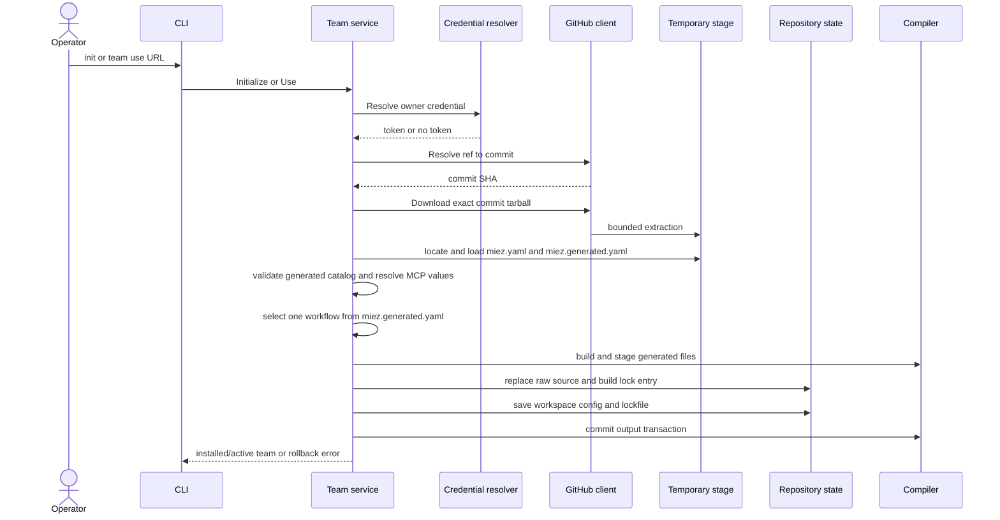

# SDD: workspace and team distribution

IEEE 1016 software design description for the planned package/workspace
manifest, GitHub distribution, credentials, MCP configuration, and team
lifecycle structure.

## 1. Context

SRS IDs this design satisfies:

- `init/remote-team-is-required`
- `artifact/team-index-is-generated`
- `team-authoring/build-produces-installable-package`
- `workflow/selection-and-routing`
- `workflow/selection-replaces-the-active-instruction`
- `workflow/completion-uses-the-installed-catalog`
- `workflow/worker-toggles-preserve-a-usable-workflow`
- `workspace/active-selection-is-local-state`
- `team-distribution/source-modules-are-isolated-from-rendered-output`
- `workspace/initialization-creates-only-required-miez-state`
- `workspace/managed-output-has-no-persistent-compiler-ledger`
- `team-distribution/miez-owned-distribution-state`
- `team-distribution/legacy-distribution-state-is-migrated`
- `team-distribution/lockfile-records-reproducible-installs`
- `team-distribution/team-use-installs-from-any-visibility-repository`
- `team-distribution/install-exposes-artifact-catalog`
- `team-distribution/credential-resolution-order-mirrors-host-conventions`
- `team-distribution/named-team-references`
- `team-distribution/team-update-refreshes-an-installed-team`
- `team-distribution/update-uses-active-team-by-default`
- `team-distribution/outdated-reports-available-updates-without-changing-anything`
- `team-audit/detects-drift-against-the-lockfile`
- `team-audit/ci-gate-mode`
- `mcp-secrets/worker-tool-dependencies-are-declared-in-team-yaml`
- `mcp-secrets/missing-tool-configuration-prompts-interactively`
- `mcp-secrets/tool-configuration-values-stay-local-and-uncommitted`
- `cli/cancellation-is-clean`
- `reliability/mutations-are-transactional`
- `security/credentials-are-not-persisted`
- `security/remote-input-is-bounded-and-path-safe`
- `compatibility/github-is-the-distribution-host`
- `compatibility/one-active-team-per-workspace`

Place on the system map: this design covers the repository workspace state,
remote distribution adapters, and the team lifecycle service.

Decisions this design follows:

- [ADR 0008: Keep miez distribution state inside `.miez`](../adr/0008-miez-owned-distribution-state.md), superseding ADR 0002
- [ADR 0003: Use a fixed GitHub credential chain without git credential helper fallback](../adr/0003-github-credential-chain.md)
- [ADR 0005: Fail early for unresolved MCP configuration](../adr/0005-fail-early-mcp-configuration.md)
- [ADR 0007: Generate the team index from package metadata and frontmatter](../adr/0007-generated-team-index.md)

## 2. Composition

| Part | Owns |
|---|---|
| `internal/cli` | Cobra command tree, flags, prompts, output, shell completion, signal cancellation, and exit-code wrappers |
| `internal/team` | `Service` orchestration for initialization, use, activation, workflow discovery, update, outdated, audit, bootstrap, MCP resolution, and local mutations |
| `internal/workspace` | Root resolution, `.miez/` directories, config load/save, distribution migration, and ignored-path setup |
| `internal/manifest` | Workspace-root `miez.yaml` metadata and named team-source map |
| `internal/lockfile` | Committed `.miez/miez.lock.yaml`, SHA-256 file hashing, and installed-entry construction |
| `internal/modules` | Safe path calculation for `.miez/miez_modules/<team-id>/` |
| `internal/ghclient` | GitHub URL parsing, ref-to-commit requests, authenticated tarball requests, bounded extraction, and redirect handling |
| `internal/credentials` | Fixed environment/`gh` credential priority and source labels |
| `internal/secrets` | MCP placeholder parsing, requirement collection, local override/environment resolution, and local value storage |
| `internal/artifacts` | Safe generated-index loading and copying used during installation |
| `internal/build` | Team-package build and generated-index validation, described in the artifact/rendering SDD |
| `internal/compile` | Render-plan creation and managed output transaction; described in the companion SDD |

The CLI constructs a `team.Service` rooted at the current repository. The
service receives the real GitHub and credential adapters in production and
fake/injected adapters in tests. The service owns sequencing, but delegates
interactive prompting to callbacks supplied by the CLI.

## 3. Information

### 3.1 Package and workspace manifests

A team package contains an authored `miez.yaml` with package metadata such as
team id, name, version, description, author, model catalog, default model, and
MCP declarations. `miez team build` reads it together with artifact
frontmatter and writes the generated `miez.generated.yaml` beside it. The package's
`miez.yaml` is retained in the installed module for metadata and provenance;
the generated `miez.generated.yaml` is the operational catalog used by miez.

An installing repository may have its own root `miez.yaml`, with workspace
metadata and a `teams` map of named GitHub sources. This is analogous to a
package manifest's dependency declarations. It identifies desired sources but
does not replace the lockfile's resolved installation state. Active team and
workflow selections belong to `.miez/config.yaml`. The config remains the
minimal durable workspace-selection record; it is not compiler bookkeeping.

`.miez/miez_modules/` is the miez-specific equivalent of a package
`node_modules/` directory. It remains named `miez_modules/` so it is not
confused with JavaScript dependencies or treated as a generic Node package
tree.

### 3.2 Committed repository records

`.miez/miez.lock.yaml` is written by successful remote install/update
operations. It is committed even though it is below `.miez/`. Each team entry
records:

- original `repo_url`;
- selected `ref` and resolved `commit`;
- source package `version`;
- sorted `deployed_files` relative to `.miez/miez_modules/<team-id>/`;
- `file_hashes`, a SHA-256 digest per deployed file.

The lockfile is the source for local audit and the starting point for update
and outdated ref checks. It does not contain credentials or MCP values.

### 3.3 Repository-local records

`.miez/config.yaml` contains a config version, normalized targets, one
`active_team`, and team-scoped `TeamState` values. Each active team state
contains exactly one `active_workflow`; workflow routing cannot be disabled and
does not contain a second workflow definition, while local worker
participation overrides remain supported.
`.miez/mcp.local.yaml` contains locally supplied MCP values with file mode
`0600`. The CLI does not create `.miez/changes/` or `.miez/runs/`; those paths
are optional artifact-owned work areas. The committed architecture
documentation lives under `.miez/architecture/` and is not runtime state
created by the CLI.

`.miez/miez_modules/<team-id>/` is an ignored copy of the validated remote
source. `.miez/miez.lock.yaml` is committed. A bootstrap directory is instead
created at the repository root under the requested team id and is not treated
as installed source.

The compiler does not create a persistent manifest or compilation summary.
When replacing output, it derives the previously managed paths from the
previous active team and workspace state, and includes the next plan's paths
in the same transaction. Extra directories and files below `.miez/` belong to
worker or skill artifacts and are never part of generic initialization.

### 3.4 Remote reference

A GitHub team URL has an owner, repository, branch/ref (default `main`), and
optional in-repository team path. Without a team path, exactly one generated
`miez.generated.yaml` must be found in the extracted repository. With a path, that
directory must contain both `miez.yaml` and `miez.generated.yaml`; this supports multiple
teams in one repository.

### 3.5 MCP values

Team MCP declarations map the environment key expected by a tool process to a
placeholder naming a source variable. The parser accepts `<VAR>`, `${VAR}`,
and `${env:VAR}`. Requirements are deduplicated and sorted before resolution.
Values are keyed by source variable in the local store and are reused on later
operations.

## 4. Interface

### Provided CLI interfaces

- `miez init [--targets copilot] [--github URL]`
- `miez team list`
- `miez team use <name-or-url>`
- `miez team bootstrap <team-id>`
- `miez team build [path]`
- `miez team update [name-or-url] [--yes|--dry-run]`
- `miez team outdated [team-id]`
- `miez team audit [team-id] [--ci]`
- `miez workflow use <workflow-id>`
- `miez worker skill add|remove` and `worker model list|set`
- `miez check [--team <id>]`

The root `--verbose` flag reports the credential source tier without printing
the credential. CLI argument failures use exit code 2, prompt cancellation uses
130, and dirty audit CI mode uses 1.

### Provided service interfaces

`team.Service` exposes lifecycle operations to the CLI:

- team-package build and generated-index validation;
- initialization and installation from a GitHub URL;
- local activation of an installed team;
- update planning and application;
- read-only outdated and audit reports;
- bootstrap and artifact checks;
- compilation-backed local state mutation and workflow selection.

The service's injected callbacks are the boundary for interactive status and
secret input. Service operations return errors rather than writing user-facing
formatting. Update planning accepts an optional team reference; an omitted
reference resolves the active team from `.miez/config.yaml` and fails before
network access when no active team exists.

### Required external interfaces

GitHub access uses:

- `GET /repos/{owner}/{repo}/commits/{ref}` for commit resolution;
- `GET /repos/{owner}/{repo}/tarball/{commit}` for exact-source download.

The client accepts an optional bearer token and preserves authorization only
across redirects between GitHub-owned hosts. The optional `gh auth token
--hostname github.com` command is a credential source, not a required
installation dependency for public repositories.

## 5. Interaction

### 5.1 Initialize or use a remote team

A failed source load, validation, secret resolution, compiler operation, source
copy, workspace save, or lockfile save invokes the applicable rollback path.
The old active source is first moved to an `old-team` staging name when a
replacement is needed; it is restored if the operation fails.

### 5.2 Workflow selection and update application

After a team is installed, workflow completion reads the sorted catalog from
the generated `miez.generated.yaml` in the active installed source and does not contact
GitHub. `workflow use` checks that the requested id exists, updates the
team-scoped `active_workflow`, and
uses the same compiler transaction as other local mutations. The previous
managed workflow instruction is removed as part of the replacement; rules and
worker/skill/model output remain independently managed.

When a team has no prior valid workflow selection, activation chooses the first
workflow in the sorted catalog. A valid existing selection is preserved when a
team is reinstalled or updated. If that selection is absent from the staged
catalog, update falls back to the first sorted workflow before compilation.

`PlanUpdate` also validates the selected workflow in the staged source. If the
selected id no longer exists, the service chooses the first workflow in the
new deterministic catalog before compiling; if the catalog is empty or invalid,
the update fails without replacing the active source or output.

### 5.3 Update planning and application

`PlanUpdate` resolves the lockfile entry and performs a cheap commit lookup.
An unchanged commit returns an up-to-date plan without a tarball. A changed
commit is downloaded once, staged, and compared by file hashes. The CLI shows
added, changed, and removed paths. `--dry-run` closes the stage without apply;
interactive decline also leaves the install unchanged; `--yes` applies the
already staged source through the same install core as `team use`. With no
argument, the CLI/service resolves `active_team` from `.miez/config.yaml`
before calling `PlanUpdate`; an absent active team is a local argument/state
error and does not contact GitHub. An explicit name or URL follows the current
resolution path.

### 5.4 Outdated and audit reports

`Outdated` enumerates one lockfile entry or all entries, resolves the recorded
ref, and returns current/latest commit pairs. It performs no local writes.
`Audit` enumerates the same entries, hashes installed source files, checks
recorded files for missing/modified status, walks for undeclared extras, and
returns sorted findings. It does not contact GitHub.

### 5.5 MCP resolution

Before a remote team source is copied or compiled, the service determines MCP
servers used by team workers. The local store and process environment are
checked first. Missing values enter the CLI prompt path only when stdin is a
terminal and `CI` is unset; otherwise the service returns a complete missing
value error. Prompted values are merged into `.miez/mcp.local.yaml` before the
installation proceeds.

## 6. Resource

The system is a single local process with synchronous filesystem and HTTP
operations. GitHub requests use a 30-second HTTP client timeout. Archive
extraction bounds compressed bytes at 64 MiB, expanded bytes at 256 MiB,
individual files at 32 MiB, and regular-file count at 10,000. These limits are
part of the current implementation rather than user-configurable policy.

Temporary download and update stages are created outside the repository and
removed when the plan is closed. Compile stages are created below the
repository and removed on commit or rollback. The repository must be writable
for successful initialization or mutation; read-only operations need only the
files they inspect and, for outdated, network access.

On a workspace created by an earlier layout, migration stages the legacy root
`miez_modules/` and `miez.lock.yaml` together, verifies the copied hashes, and
commits both moves as one filesystem mutation. If the destination already
contains conflicting state, migration fails without deleting the legacy source.
After migration, all distribution operations use the `.miez/` paths. No
migration creates `.miez/changes/`, `.miez/runs/`, `manifest.json`, or
`compiled.json`.

There is no process-wide lock, distributed transaction, encrypted secret store,
or retry queue. The design assumes one active miez mutation at a time.
